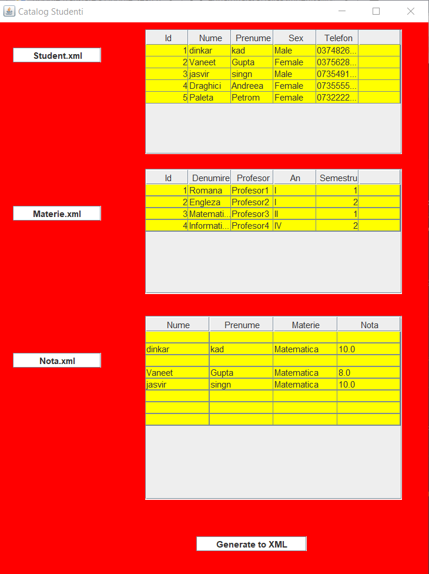

## Student Management Application , ACE UCv 2022 , Practice Stage

------------

### Description about application:

#### This is a GUI application that will read data from 3 xml (.*xml) files and generate a report for specified discipline with save in a xml (.* xml) file.

------

### Inputs for application:

#### The application receives 3 xml (.*xml) files.

---------

### How to run:

#### 1. After application started , user should be able to import three xml files where the content of that files will be displayed into a table view into GUI.

#### 2. After the 3 files have been imported into the GUI, the user can see their content, based on this information, the user can generate a report for specified discipline when the students are alphabetically sorted. 

-----
### Outputs for application:
#### The report will be generated into a xml (.*xml) file.

----

### Abbreviations:

| Syntax      | Description |
| ----------- | ----------- |
| GUI         | **G**raphical **U**ser **I**nterface       |
| XML         | **Ex**tensible **M**arkup **L**anguage        |

-----------

### History:

#### Version 1.0.0 - Initial Version

--------------

